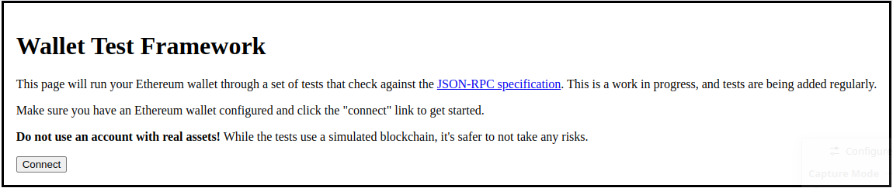
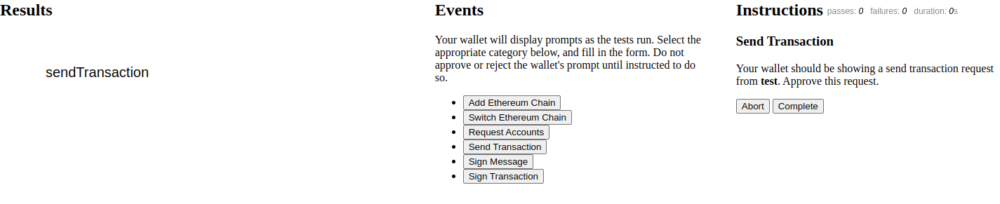
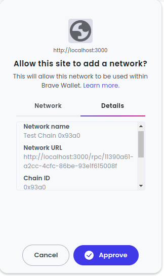
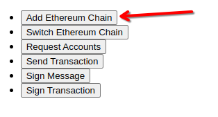
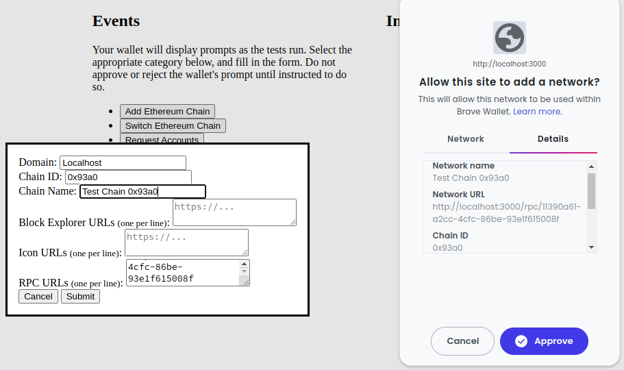
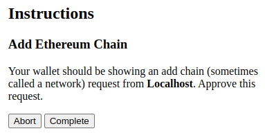
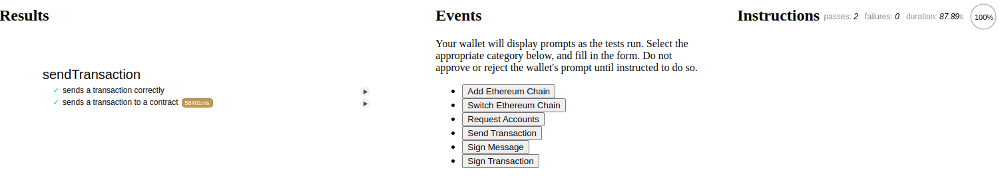

# The Manual Glue & You

The manual glue is the most generic way to try Wallet Test Framework. It displays instructions to a human user and generates events based on button presses and form inputs. Ideally every wallet will have bespoke integration, but the manual glue works even when no integration has been written yet.

## Requirements

At minimum, your wallet must support:

- Custom RPC Endpoints (e.g. [`wallet_addEtherereumChain`](https://eips.ethereum.org/EIPS/eip-3085))
- Needs to inject [`window.ethereum`](https://eips.ethereum.org/EIPS/eip-1193)

_Mobile wallet and WalletConnect support coming soon!_

## Options

You can choose what tests to run by appending a `grep` query parameter:

```
http://localhost:3000/?grep=sendTransaction
```

## Using the Manual Glue

!!! warning "Do not click any wallet buttons without being instructed to!"

    The manual glue will provide explicit instructions on when to approve/reject prompts from your wallet. Clicking buttons before being asked to will cause tests to fail.

### Connecting your Wallet


The first page that greets you from Wallet Test Framework is the connect page. Clicking the connect button will establish a connection from the tests to your wallet.

### Explaining the User Interface

The user interface is divided into three columns: test results, events, and instructions.


The results column will contain the names of tests and their pass/fail status. The middle column (events) has buttons that you press when your wallet requests user input. The last column (instructions) will provide the responses to give to the wallet.

### Requesting User Input

Here is a hypothetical prompt that your wallet might display.


To inform the test that the wallet is requesting information, choose the correct button from the center column. In this case it's "Add Ethereum Chain":



In the dialog that opens, copy the relevant information from your wallet and click submit.



### Responding to a Prompt

After reporting an event, WTF may give the user instructions to follow. These will be displayed in the rightmost column:



Make sure to follow the instructions before clicking complete.

### Results


