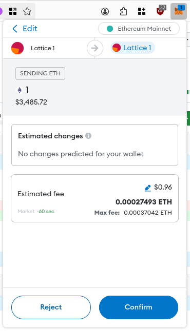

# Writing your First Test

See [Development](./development.md) for setup instructions.

## Adding a Test

The tests can be found in [`client/src/tests/eth`](https://github.com/wallet-test-framework/framework/tree/master/client/src/tests/eth), organized into files based on the RPC endpoint being tested. If your test fits in an existing file, you may add it accordingly. If not, add a new file following the current convention, and update the list of test files found in [`/client/src/tests.ts`](https://github.com/wallet-test-framework/framework/blob/master/client/src/tests.ts).

Tests under the `eth` directory are meant to be general purpose, and should apply to any wallet.

### Libraries

The tests use [Mocha](https://www.npmjs.com/package/mocha) ([docs](https://mochajs.org/#table-of-contents)) as the test runner, and use [Assert](https://www.npmjs.com/package/assert) ([docs](https://nodejs.org/api/assert.html)) for assertions.

To interact with the blockchain and wallet, the tests use [Viem](https://www.npmjs.com/package/viem) ([docs](https://viem.sh/docs/getting-started)).

### Boilerplate

The following is an example of a trivial test:

```typescript
import * as tests from "../../tests";
import assert from "assert";

const blockchain = tests.blockchain;
const wallet = tests.wallet;

if (!blockchain || !wallet) {
  throw "not ready";
}

describe("accounts", () => {
  it("returns a list of accounts", async () => {
    const accounts = await wallet.wallet.getAddresses();

    for (const account of accounts) {
      assert.ok(account.startsWith("0x"), "account is a hex string");
    }
  });
});
```

In this example, we create a suite of tests called `accounts` with a single test `returns a list of accounts`.

### Manipulating the Blockchain

The simulated blockchain may be controlled using the `blockchain` variable that is provided to every test file. Here's an example of how to mine a block:

```typescript
await blockchain.test.mine({ blocks: 1 });
```

The available functions are documented [here](https://viem.sh/docs/actions/test/introduction).

### Interacting with the Wallet

#### Initiating an Action

Beginning an action is no different than a standard viem call. For example to send a transaction:

```typescript
const responsePromise = wallet.wallet.sendTransaction({
  account: sender,
  to: sender,
  value: value,
});
```

To support automated glue, there is a bit more to do.

#### Responding to Prompts

Many wallet operations will require some user input, ranging from approving a transaction (pictured below) to filling out a form for adding a new network. Providing this user input is the job of the test writer. Wallet Test Framework provides some abstractions to make dealing with a variety of wallets easier.



Continuing from the above example, here's how to wait for the wallet dialog:

```typescript
const sendEvent = await wallet.glue.next("sendtransaction");
```

The returned event will contain information about the dialog the wallet displayed. In the case of `sendtransaction`, it will have the sending address (`from`), the destination address (`to`), etc.

To click a button in the wallet, call the appropriate method on `wallet.glue`. For example, to approve the sending of the transaction:

```typescript
await wallet.glue.sendTransaction({
  id: sendEvent.id,
  action: "approve",
});
```

### Trying your Test

To execute a suite of tests, you can use the `grep` query parameter:

```
http://localhost:3000/?grep=estimateGas
```

Where `estimateGas` is the first argument passed to Mocha's `describe`.

For an up to date list of tests, see [`client/src/tests/eth`](https://github.com/wallet-test-framework/framework/tree/master/client/src/tests/eth). See [The Manual Glue & You](./guide-manual.md) for detailed instructions on how to use the manual glue.

## Coding Standards

Our coding standards are enforced by [Prettier](https://www.npmjs.com/package/prettier), and [ESLint](https://www.npmjs.com/package/eslint).

To check for issues, use:

```bash
npm test
```

To automatically fix issues, use:

```bash
npm run fmt
```
